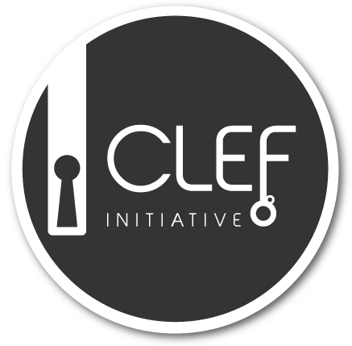
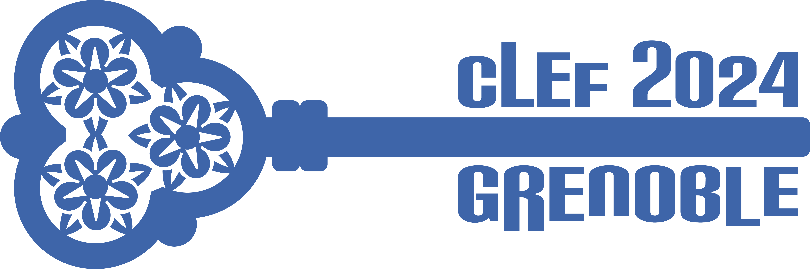

# CLEF 2024 SimpleText Track

---

[Home](./) | [Call for papers](./CFP) | [Important dates](./dates) | [Tasks](./tasks)  | [Tools](./tools) | 
[Program](./program) | [Publications](./publications) | [Organizers](./organizers) | [Contact](./contact) | [CLEF-2023](https://simpletext-project.com/2023/clef/)

---

  

## SimpleText: Automatic Simplification of Scientific Texts

The general public tends to avoid reliable sources such as scientific literature due to their complex language and lacking background knowledge. Instead, they rely on shallow and derived sources on the web and in social media - often published for commercial or political incentives, rather than informational value. Can text simplification help to remove some of these access barriers? The SimpleText track is a part of the CLEF initiative which promotes the systematic evaluation of information access systems, primarily through experimentation on shared tasks. SimpleText addresses the challenges of text simplification approaches in the context of promoting scientific information access, by providing appropriate data and benchmarks. The track uses a corpus of scientific literature abstracts and popular science requests. Our overall use case is to create a simplified summary of multiple scientific documents based on a popular science query which provides a user with an accessible overview of this specific topic.  
The track has the following four concrete tasks.
 
## [Tasks](./tasks)
- [Task 1](./tasks): What is in (or out)? Selecting passages to include in a simplified summary.
- [Task 2](./tasks): What is unclear? Difficult concept identification and explanation (definitions, abbreviation deciphering, context, applications,..).
- [Task 3](./tasks): Rewrite this! Given a query, simplify passages from scientific abstracts.
- [Task 4](./tasks): SOTA? Given an AI paper which reports model performances on benchmark datasets, extract all related information (task, dataset, metric, score).

## How to participate
In order to participate, you should sign up at the [CLEF](https://clef2024.clef-initiative.eu/index.php) website. The registration opens on 13th November 2023.

All team members should join the SimpleText mailing list:
[https://groups.google.com/g/simpletext](https://groups.google.com/g/simpletext). 

The data will be made available to all registered participants.

## Acknowledgement  

SimpleText is supported by the French research network on Big Data - Data Science [MADICS](https://www.madics.fr/). This research was funded, in whole or in part, by the French National Research Agency (ANR) under the project [ANR-22-CE23-0019-01](https://anr.fr/Project-ANR-22-CE23-0019).

## References  

- L. Ermakova, E. SanJuan, S. Huet, H. Azarbonyad, O. Augereau, J. Kamps. "Overview of the CLEF 2023 SimpleText Lab: Automatic Simplification of Scientific Texts." Proceeding of CLEF’23, LNCS, Springer
- L. Ermakova, E. SanJuan, S. Huet, O. Augereau, H. Azarbonyad, and J. Kamps. "CLEF 2023 SimpleText Track: What Happens If General Users Search Scientific Texts?” ECIR 2023 Proceedings
- [É. Sanjuan, S. Huet, J. Kamps, L. Ermakova. "Overview of the CLEF 2023 SimpleText Task 1: Passage Selection for a Simplified Summary."](https://www.dei.unipd.it/~faggioli/temp/CLEF2023-proceedings/paper-238.pdf)
- [L. Ermakova, H. Azarbonyad, S. Bertin, O. Augereau. "Overview of the CLEF 2023 SimpleText Task 2: Difficult Concept Identification and Explanation."](https://www.dei.unipd.it/~faggioli/temp/CLEF2023-proceedings/paper-239.pdf)
- [L. Ermakova, S. Bertin, H. McCombie, J. Kamps. "Overview of the CLEF 2023 SimpleText Task 3: Simplification of Scientific Texts."](https://www.dei.unipd.it/~faggioli/temp/CLEF2023-proceedings/paper-240.pdf)

---

 
 
 
 

